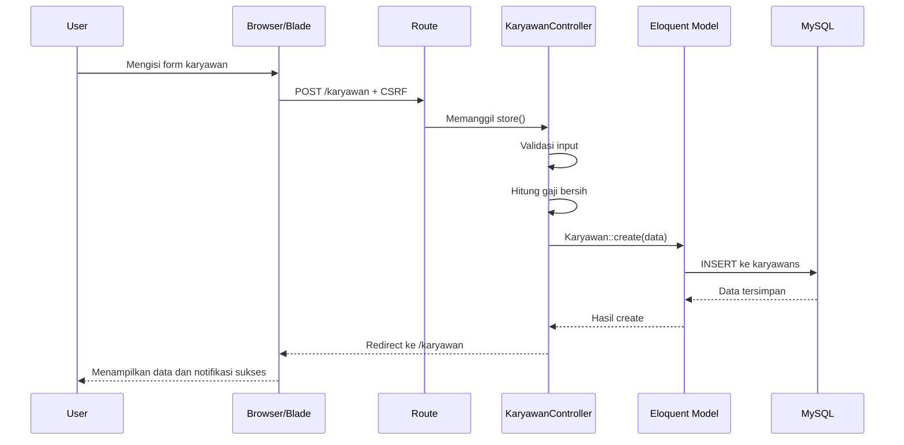

# Panduan Aplikasi E-Penggajian untuk Pemula

Dokumen ini menjelaskan cara kerja aplikasi Laravel E-Penggajian dari awal sampai akhir. Tujuannya bukan hanya agar aplikasi bisa dipakai, tetapi agar setiap bagian kodenya dapat dipelajari oleh pemula.

---

## 1. Gambaran Besar Aplikasi

Aplikasi ini digunakan untuk:

- login administrator;
- melihat daftar karyawan;
- menambah data karyawan;
- mengubah data karyawan;
- menghapus data karyawan;
- menghitung gaji bersih;
- melihat slip gaji;
- mencetak atau membuat PDF slip gaji;
- membagikan rincian slip melalui WhatsApp;
- mengirim slip melalui email dari backend Laravel.

Rumus gaji bersih yang digunakan:

```text
gaji_bersih = gaji_pokok + lembur - pinjaman
```

Contoh:

```text
gaji_pokok = 8.000.000
lembur      = 2.000.000
pinjaman    = 500.000

hasil = 8.000.000 + 2.000.000 - 500.000
      = 9.500.000
```

---

## 2. Teknologi yang Dipakai

| Teknologi | Fungsi |
|---|---|
| PHP | Bahasa pemrograman backend |
| Laravel | Framework aplikasi web PHP |
| MySQL | Database yang dipakai di `.env` |
| Blade | Template HTML milik Laravel |
| Bootstrap | Tampilan dan komponen UI |
| Eloquent | Cara Laravel berkomunikasi dengan database |
| Dompdf | Membuat slip gaji menjadi PDF |
| Mail Laravel | Mengirim email dengan lampiran PDF |
| Vite | Pengelolaan asset frontend |

Laravel memakai pola MVC:

```text
Browser
   |
   v
Route -> Controller -> Model -> Database
   |
   v
View/Blade -> HTML yang dilihat pengguna
```

Penjelasan singkat:

- **Route** menentukan URL dan method yang tersedia.
- **Controller** menerima request dan menjalankan aturan aplikasi.
- **Model** mewakili tabel database.
- **View** menampilkan halaman HTML.
- **Migration** menjelaskan bentuk tabel database.
- **Seeder** mengisi data awal.

---

## 3. Struktur Folder Penting

```text
app/
  Http/Controllers/       Logika request dan response
  Mail/                   Kelas email
  Models/                 Model database

bootstrap/
  app.php                 Konfigurasi awal aplikasi

config/
  auth.php                Pengaturan login
  database.php            Pengaturan koneksi database
  mail.php                Pengaturan email

 database/
  migrations/             Riwayat struktur database
  seeders/                Data awal database

resources/views/
  auth/                   Halaman login
  karyawan/               Halaman karyawan dan slip gaji
  layouts/                Template layout bersama
  emails/                 Template isi email

routes/
  web.php                 Daftar URL aplikasi

public/
  index.php               Pintu masuk semua request web

storage/
  logs/                   Log error dan email log
  framework/              File cache Laravel

tests/
  Feature/                Test alur HTTP
  Unit/                   Test fungsi kecil
```

---

## 4. Cara Menjalankan Project

Pastikan PHP, Composer, MySQL, dan Node.js tersedia.

Cek PHP dan Composer:

```powershell
php -v
composer -V
```

Buat atau pastikan database MySQL bernama `slipgaji` tersedia. Pengaturan project ada di `.env`:

```dotenv
DB_CONNECTION=mysql
DB_HOST=127.0.0.1
DB_PORT=3306
DB_DATABASE=slipgaji
DB_USERNAME=root
DB_PASSWORD=
```

Jalankan migration:

```powershell
php artisan migrate
```

Buat akun admin dan data contoh:

```powershell
php artisan db:seed
```

Jalankan server:

```powershell
php artisan serve
```

Buka:

```text
http://127.0.0.1:8000
```

Akun admin dibuat dari nilai di `.env`:

```dotenv
ADMIN_EMAIL=admin@example.com
ADMIN_NAME=Administrator
ADMIN_PASSWORD=password-ku
```

`UserSeeder` memakai `updateOrCreate()`, jadi email yang sama diperbarui dan tidak dibuat ganda. Password diubah menjadi hash dengan `Hash::make()`. Ganti nilai contoh sebelum aplikasi dipakai sungguhan.

---

## 5. Alur Request Laravel

Saat pengguna membuka halaman, proses umumnya seperti ini:

1. Browser mengirim request, misalnya `GET /karyawan`.
2. Laravel menerima request melalui `public/index.php`.
3. Laravel membaca route di `routes/web.php`.
4. Route menjalankan method controller.
5. Controller mengambil atau mengubah data melalui model.
6. Controller mengirim data ke Blade view.
7. Blade menghasilkan HTML.
8. HTML dikirim kembali ke browser.

Contoh alur daftar karyawan:

```mermaid
flowchart TD
    A[Browser: GET /karyawan] --> B[routes/web.php]
    B --> C[KaryawanController@index]
    C --> D[Karyawan::orderBy lalu get]
    D --> E[Database tabel karyawans]
    E --> F[resources/views/karyawan/index.blade.php]
    F --> G[HTML dikirim ke browser]
```

---

### Cara Membaca Contoh Kode di Panduan

Setiap contoh kode di bawah selalu memiliki tiga informasi:

1. **File**: lokasi kode sebenarnya di project.
2. **Bagian kode**: nama method, route, atau bagian Blade/JavaScript.
3. **Kode**: potongan yang sama dengan kode project.

Contoh:

**File:** [app/Http/Controllers/KaryawanController.php](../app/Http/Controllers/KaryawanController.php)  
**Bagian:** method `index()`

```php
$karyawan = Karyawan::orderBy('id', 'desc')->get();
return view('karyawan.index', compact('karyawan'));
```

Artinya kode tersebut mencari data karyawan, lalu mengirimnya ke file [resources/views/karyawan/index.blade.php](../resources/views/karyawan/index.blade.php). Jadi ketika menemukan nama method atau potongan kode di panduan, buka file yang tertulis tepat di atas contoh.

---

## 6. Route dan URL

File utama route adalah [routes/web.php](../routes/web.php).

### Route halaman awal

```php
Route::get('/', function () {
    return redirect()->route('login');
});
```

Artinya ketika URL `/` dibuka, pengguna diarahkan ke halaman login.

### Route login

```php
Route::get('/login', [AuthController::class, 'showLoginForm'])
    ->name('login');

Route::post('/login', [AuthController::class, 'login'])
    ->name('login.process');
```

Ada dua request berbeda:

- `GET /login` menampilkan form.
- `POST /login` memproses email dan password.

Method HTTP penting:

| Method | Arti umum |
|---|---|
| GET | Membaca atau menampilkan data |
| POST | Membuat atau mengirim data |
| PUT/PATCH | Mengubah data |
| DELETE | Menghapus data |

### Middleware auth

```php
Route::middleware('auth')->group(function () {
    // route karyawan
});
```

Semua route di dalam group hanya boleh dibuka oleh user yang sudah login. Jika belum login, Laravel mengarahkan user ke halaman login.

### Route resource

```php
Route::resource('karyawan', KaryawanController::class);
```

Satu baris ini membuat route CRUD standar:

| Method | URL | Controller |
|---|---|---|
| GET | `/karyawan` | `index` |
| GET | `/karyawan/create` | `create` |
| POST | `/karyawan` | `store` |
| GET | `/karyawan/{karyawan}/edit` | `edit` |
| PUT/PATCH | `/karyawan/{karyawan}` | `update` |
| DELETE | `/karyawan/{karyawan}` | `destroy` |
| GET | `/karyawan/{karyawan}` | `show` |

Aplikasi juga memiliki route tambahan:

```text
GET  /karyawan/{id}/slip
GET  /karyawan/{id}/slip/cetak
POST /karyawan/{id}/slip/email
```

Untuk melihat semua route:

```powershell
php artisan route:list
```

---

## 7. Login dan Authentication

File yang terlibat:

- [routes/web.php](../routes/web.php)
- [app/Http/Controllers/AuthController.php](../app/Http/Controllers/AuthController.php)
- [resources/views/auth/login.blade.php](../resources/views/auth/login.blade.php)
- [app/Models/User.php](../app/Models/User.php)
- [config/auth.php](../config/auth.php)

### Form login

Di Blade:

```blade
<form method="POST" action="{{ route('login.process') }}">
    @csrf
```

`method="POST"` berarti data dikirim ke route proses login.

`route('login.process')` membuat URL berdasarkan nama route, sehingga URL tidak perlu ditulis manual.

`@csrf` menghasilkan token keamanan. Laravel menolak request POST tanpa token ini dengan error `419 Page Expired`.

### Controller login

Controller mengambil data:

```php
$credentials = $request->validate([
    'email' => ['required', 'email'],
    'password' => ['required'],
]);
```

Validasi tersebut berarti:

- email wajib diisi;
- email harus memiliki format email;
- password wajib diisi.

Autentikasi dilakukan dengan:

```php
if (Auth::attempt($credentials, $remember)) {
    $request->session()->regenerate();
    return redirect()->intended('/karyawan');
}
```

Laravel mencari user berdasarkan email, lalu membandingkan password input dengan password hash di database.

`session()->regenerate()` penting untuk mengganti session ID setelah login dan membantu mencegah session fixation.

Jika gagal, controller kembali ke halaman sebelumnya dengan pesan error.

### User model

[app/Models/User.php](../app/Models/User.php) mewarisi `Authenticatable`, bukan model biasa. Itu membuatnya bisa dipakai oleh sistem login Laravel.

Bagian password:

```php
'password' => 'hashed',
```

Laravel akan membantu melakukan hashing ketika password diisi melalui model. Seeder saat ini juga memakai `Hash::make()` secara eksplisit.

### Seeder login

[database/seeders/UserSeeder.php](../database/seeders/UserSeeder.php) membuat atau memperbarui user:

```text
Email    : admin@gmail.com
Password : password
```

Perintah:

```powershell
php artisan db:seed --class=UserSeeder
```

---

## 8. Database, Migration, dan Seeder

### Apa itu migration?

Migration adalah versi atau riwayat struktur database dalam bentuk kode. Migration dapat:

- membuat tabel;
- menambah kolom;
- mengubah kolom;
- menghapus kolom.

Contoh:

```php
$table->string('nama', 100);
$table->decimal('gaji_pokok', 12, 2)->default(0);
```

`string` membuat kolom teks. `decimal(12, 2)` menyimpan angka dengan maksimal 12 digit dan 2 angka desimal.

Menjalankan migration:

```powershell
php artisan migrate
```

Melihat status:

```powershell
php artisan migrate:status
```

Mengulang dari database kosong:

```powershell
php artisan migrate:fresh
```

Perhatian: `migrate:fresh` menghapus semua tabel dan data. Setelah itu jalankan seeder lagi.

### Tabel karyawans

Struktur efektif tabel karyawan:

| Kolom | Fungsi |
|---|---|
| `id` | ID otomatis |
| `nik` | Nomor identitas karyawan |
| `nama` | Nama karyawan |
| `jabatan` | Jabatan karyawan |
| `periode_bulan` | Nomor bulan periode yang dipilih, 1 sampai 12 |
| `periode_tahun` | Tahun periode yang dipilih |
| `tanggal_awal` | Awal periode, dihitung otomatis |
| `tanggal_akhir` | Akhir periode, dihitung otomatis |
| `no_whatsapp` | Nomor WhatsApp, boleh kosong |
| `email` | Email karyawan, boleh kosong |
| `gaji_pokok` | Gaji utama |
| `lembur` | Uang lembur |
| `pinjaman` | Potongan pinjaman |
| `gaji_bersih` | Hasil perhitungan akhir |
| `created_at` | Waktu dibuat |
| `updated_at` | Waktu diubah |

### Mengapa ada beberapa migration karyawan?

Project ini dibuat secara bertahap. Migration utama membuat sebagian besar kolom, lalu migration berikutnya memperbaiki atau melengkapi database lama.

File penting:

- [2026_09_14_065815_create_karyawans_table.php](../database/migrations/2026_09_14_065815_create_karyawans_table.php) membuat tabel utama.
- [2026_09_14_113319_add_nik_to_karyawans_table.php](../database/migrations/2026_09_14_113319_add_nik_to_karyawans_table.php) defensif: hanya menambah `nik` jika belum ada.
- [2026_09_14_130000_add_gaji_bersih_to_karyawans_table.php](../database/migrations/2026_09_14_130000_add_gaji_bersih_to_karyawans_table.php) melengkapi kolom karyawan yang belum ada.
- [2026_09_14_131000_make_optional_karyawan_fields_nullable.php](../database/migrations/2026_09_14_131000_make_optional_karyawan_fields_nullable.php) membuat email dan WhatsApp boleh kosong.
- [2026_09_15_000000_add_periode_to_karyawans_table.php](../database/migrations/2026_09_15_000000_add_periode_to_karyawans_table.php) menambahkan `tanggal_awal` dan `tanggal_akhir`.
- [2026_09_15_010000_add_periode_bulan_to_karyawans_table.php](../database/migrations/2026_09_15_010000_add_periode_bulan_to_karyawans_table.php) menambahkan kolom `periode_bulan` untuk menyimpan bulan yang dipilih.
- [2026_09_15_020000_add_periode_tahun_to_karyawans_table.php](../database/migrations/2026_09_15_020000_add_periode_tahun_to_karyawans_table.php) menambahkan kolom `periode_tahun` untuk menyimpan tahun yang dipilih.

### Seeder karyawan

[database/seeders/KaryawanSeeder.php](../database/seeders/KaryawanSeeder.php) memasukkan data contoh.

[database/seeders/DatabaseSeeder.php](../database/seeders/DatabaseSeeder.php) menjalankan semua seeder:

```php
$this->call([
    UserSeeder::class,
    KaryawanSeeder::class,
]);
```

Perintah lengkap:

```powershell
php artisan db:seed
```

---

## 9. Model Eloquent

File [app/Models/Karyawan.php](../app/Models/Karyawan.php) mewakili tabel `karyawans`.

```php
protected $table = 'karyawans';
protected $guarded = [];
```

Laravel biasanya menebak nama tabel dari nama model. Karena modelnya `Karyawan`, tabel jamaknya bisa ditebak sebagai `karyawans`, tetapi deklarasi eksplisit membuat maksudnya jelas.

`$guarded = []` berarti semua kolom boleh diisi melalui mass assignment:

```php
Karyawan::create([
    'nik' => $request->nik,
    'nama' => $request->nama,
]);
```

Mass assignment harus digunakan hati-hati. Untuk aplikasi yang lebih aman, biasanya lebih baik memakai `$fillable` dan hanya memasukkan kolom yang memang boleh diisi.

Contoh operasi Eloquent:

```php
Karyawan::all();
Karyawan::findOrFail($id);
Karyawan::create($data);
$karyawan->update($data);
$karyawan->delete();
```

---

## 10. CRUD Karyawan

File utama: [app/Http/Controllers/KaryawanController.php](../app/Http/Controllers/KaryawanController.php).

### Menampilkan daftar

```php
$karyawan = Karyawan::orderBy('id', 'desc')->get();
return view('karyawan.index', compact('karyawan'));
```

Artinya:

1. Ambil tabel `karyawans`.
2. Urutkan ID terbesar ke terkecil.
3. Ambil semua hasil.
4. Kirim hasil ke view dengan nama `$karyawan`.

Di Blade, data ditampilkan dengan loop:

```blade
@forelse($karyawan as $item)
    {{ $item->nama }}
@empty
    Belum ada data
@endforelse
```

### Menampilkan form tambah

Method `create()` hanya mengembalikan view:

```php
return view('karyawan.create');
```

Form ada di [resources/views/karyawan/create.blade.php](../resources/views/karyawan/create.blade.php).

### Menyimpan data

Method `store()` menjalankan urutan:

1. validasi input;
2. mengambil angka gaji;
3. menghitung gaji bersih;
4. menyimpan data ke database;
5. redirect ke daftar karyawan.

Validasi NIK:

```php
'nik' => 'required|string|max:20|unique:karyawans,nik'
```

`unique:karyawans,nik` mencegah dua karyawan memakai NIK yang sama.

Setelah validasi:

```php
$gajiPokok = (float) $request->input('gaji_pokok', 0);
$lembur = (float) $request->input('lembur', 0);
$pinjaman = (float) $request->input('pinjaman', 0);
$gajiBersih = ($gajiPokok + $lembur) - $pinjaman;
```

Casting ke `float` membuat nilai diperlakukan sebagai angka sebelum dihitung.

### Mengubah data

Method `edit()` mengambil data berdasarkan ID dan menampilkan form edit.

Method `update()` hampir sama dengan `store()`, tetapi validasi NIK mengabaikan data yang sedang diedit:

```php
Rule::unique('karyawans')->ignore($karyawan->id)
```

Tanpa `ignore`, menyimpan data tanpa mengubah NIK sendiri bisa dianggap sebagai duplikat.

### Menghapus data

Method `destroy()`:

```php
$karyawan = Karyawan::findOrFail($id);
$karyawan->delete();
```

`findOrFail()` menghasilkan error 404 jika ID tidak ditemukan.

---

## 11. Blade View dan Layout

Blade adalah template engine Laravel. File Blade menggunakan ekstensi `.blade.php`.

### Layout utama

[resources/views/layouts/app.blade.php](../resources/views/layouts/app.blade.php) berisi bagian yang digunakan banyak halaman:

- sidebar;
- navigasi;
- informasi user login;
- tombol logout;
- notifikasi sukses dan error;
- Bootstrap;
- tempat isi halaman;
- tempat script tambahan.

Di layout:

```blade
@yield('content')
@stack('scripts')
```

Di halaman anak:

```blade
@extends('layouts.app')

@section('content')
    Isi halaman
@endsection
```

`@extends` memakai layout. `@section` mengisi bagian yang disediakan layout.

### Data dari PHP ke HTML

Contoh:

```blade
{{ $item->nama }}
```

Tanda `{{ }}` mencetak nilai dengan escaping HTML untuk mengurangi risiko XSS.

### Form Blade

```blade
@csrf
@method('DELETE')
```

HTML form hanya mendukung GET dan POST secara langsung. `@method('DELETE')` memberi tahu Laravel bahwa form tersebut dimaksudkan sebagai DELETE.

### Notifikasi session

Controller dapat mengirim pesan:

```php
return redirect()->route('karyawan.index')
    ->with('success', 'Data berhasil disimpan');
```

Layout membaca pesan tersebut:

```blade
@if(session('success'))
    {{ session('success') }}
@endif
```

---

## 12. Perhitungan Gaji di Browser dan Server

Form tambah dan edit menghitung total secara langsung dengan JavaScript agar pengguna melihat hasil sebelum submit.

Kode browser mengambil nilai:

```javascript
const valGaji = parseFloat(gajiPokok.value) || 0;
const valLembur = parseFloat(lembur.value) || 0;
const valPinjaman = parseFloat(pinjaman.value) || 0;
```

Lalu menghitung:

```javascript
const penghasilan = valGaji + valLembur;
const potongan = valPinjaman;
const bersih = penghasilan - potongan;
```

Tetapi perhitungan penting juga dilakukan ulang di controller. Ini benar karena JavaScript di browser dapat diubah oleh pengguna. Server tidak boleh mempercayai hasil dari browser.

Alur yang aman:

```text
Browser menghitung untuk tampilan
Server menghitung ulang untuk data yang disimpan
```

---

## 13. Slip Gaji dan PDF

Method `slip()` menampilkan slip di browser:

```php
$karyawan = Karyawan::findOrFail($id);
return view('karyawan.slip', compact('karyawan'));
```

Method `cetakSlip()` membuat PDF:

```php
$pdf = Pdf::loadView('karyawan.pdf', compact('karyawan'))
    ->setPaper('a4', 'portrait');

return $pdf->stream($fileName);
```

Urutannya:

1. Ambil data karyawan.
2. Render view `karyawan.pdf` menjadi HTML.
3. Dompdf mengubah HTML menjadi PDF.
4. PDF ditampilkan langsung di browser.

Template PDF adalah [resources/views/karyawan/pdf.blade.php](../resources/views/karyawan/pdf.blade.php).

Jika PDF error, cek:

```powershell
composer show barryvdh/laravel-dompdf
```

---

## 14. WhatsApp

Tombol WhatsApp di halaman daftar membuat pesan menggunakan JavaScript, lalu membuka URL:

```text
https://wa.me/nomor?text=pesan
```

Nomor diawali `0` diubah menjadi kode negara `62`.

Contoh:

```text
08123456789 -> 628123456789
```

Fitur ini tidak mengirim pesan otomatis dari server. Fitur ini hanya membuka WhatsApp dengan teks yang sudah disiapkan. Pengguna tetap menekan tombol kirim di WhatsApp.

Catatan: kolom `no_whatsapp` tersedia di database dan seeder, tetapi form tambah/update saat ini belum meminta atau menyimpan nilainya. Tombol WhatsApp meminta nomor melalui modal.

---

## 15. Email dan PDF Attachment

Ada dua konsep email di project ini.

### Tombol email di tampilan

Tombol email yang terlihat di halaman daftar membuat URL Gmail compose. Artinya browser membuka Gmail dengan penerima, subjek, dan isi email yang sudah diisi.

Fitur ini tidak menggunakan endpoint backend dan tidak otomatis melampirkan PDF.

### Email backend Laravel

Controller memiliki method `kirimEmail()` pada endpoint:

```text
POST /karyawan/{id}/slip/email
```

Method tersebut:

1. mengambil data karyawan;
2. memvalidasi email tujuan;
3. membuat PDF slip;
4. memasukkan PDF sebagai attachment;
5. mengirim `SlipGajiMail` melalui Laravel Mail;
6. menyimpan email ke karyawan jika sebelumnya masih kosong.

Kelas email ada di:

```text
app/Mail/SlipGajiMail.php
```

Template email ada di:

```text
resources/views/emails/slip_gaji.blade.php
```

### Konfigurasi mail

Di `.env` saat ini:

```dotenv
MAIL_MAILER=log
```

Driver `log` menulis isi email ke file log, bukan mengirim email sungguhan. Untuk mengirim melalui SMTP, ubah konfigurasi sesuai penyedia email, lalu jalankan:

```powershell
php artisan config:clear
```

Jangan menaruh password email sungguhan di repository atau membagikan file `.env`.

---

## 16. Konfigurasi Penting

### `.env`

`.env` berisi konfigurasi mesin lokal, misalnya:

- koneksi database;
- URL aplikasi;
- session;
- mail;
- cache;
- queue.

`.env` berbeda untuk setiap komputer dan tidak sebaiknya di-commit.

### `config/auth.php`

Mengatur:

- guard `web`;
- session authentication;
- model `App\Models\User`.

### `config/database.php`

Mendefinisikan format koneksi MySQL, SQLite, MariaDB, PostgreSQL, dan SQL Server.

Nilai yang digunakan aplikasi berasal dari `.env` melalui `env('NAMA_VARIABLE')`.

### `config/mail.php`

Mendefinisikan mailer seperti SMTP, log, array, failover, dan lainnya.

---

## 17. Perintah Artisan yang Sering Dipakai

```powershell
php artisan serve
```

Menjalankan server development.

```powershell
php artisan route:list
```

Menampilkan semua route.

```powershell
php artisan migrate
```

Menjalankan migration yang belum dijalankan.

```powershell
php artisan migrate:status
```

Melihat migration yang sudah atau belum berjalan.

```powershell
php artisan migrate:fresh --seed
```

Menghapus semua tabel, membuat ulang tabel, lalu mengisi data seed. Jangan gunakan pada database penting.

```powershell
php artisan db:seed
```

Menjalankan `DatabaseSeeder`.

```powershell
php artisan optimize:clear
```

Membersihkan cache konfigurasi, route, view, dan cache Laravel.

```powershell
php artisan view:cache
```

Mengompilasi Blade view dan mendeteksi beberapa error view lebih awal.

```powershell
php artisan tinker
```

Membuka console interaktif Laravel untuk mencoba model dan query.

```powershell
php artisan db:table karyawans
```

Melihat struktur tabel.

```powershell
php artisan test
```

Menjalankan test.

---

## 18. Cara Membaca Error Umum

### `Unknown column`

Contoh:

```text
Unknown column 'nip'
```

Artinya kode mencoba memakai kolom yang tidak ada di database. Bandingkan:

1. nama kolom di migration;
2. nama kolom di model/controller;
3. struktur tabel dengan `php artisan db:table karyawans`.

### `Duplicate column name`

Artinya migration menambahkan kolom yang sudah dibuat migration sebelumnya. Gunakan pengecekan seperti:

```php
if (! Schema::hasColumn('karyawans', 'nik')) {
    // tambahkan kolom
}
```

Namun sebaiknya juga rapikan migration agar tidak membuat struktur ganda.

### `Field doesn't have a default value`

Artinya query insert tidak mengirim kolom wajib dan kolom itu tidak memiliki nilai default. Solusinya salah satu:

- tambahkan input dan simpan field tersebut;
- buat kolom nullable;
- beri default yang masuk akal.

### `419 Page Expired`

Biasanya disebabkan:

- form tidak memiliki `@csrf`;
- session/cookie bermasalah;
- domain atau port berubah;
- server lama masih berjalan dengan konfigurasi berbeda.

Coba:

```powershell
php artisan optimize:clear
```

Lalu refresh browser.

### `302` pada halaman `/`

Aplikasi memang mengarahkan `/` ke `/login`, sehingga status `302` adalah perilaku yang diharapkan. Test yang mengharapkan `/` langsung `200` harus mengikuti redirect atau menguji `/login`.

### Email tidak terkirim

Cek `MAIL_MAILER`. Jika nilainya `log`, email hanya ditulis ke log. Cek:

```text
storage/logs/laravel.log
```

### Database menggunakan SQLite padahal ingin MySQL

Cek `.env`:

```dotenv
DB_CONNECTION=mysql
```

Setelah mengganti `.env`, bersihkan cache:

```powershell
php artisan config:clear
```

---

## 19. Hal yang Perlu Diperhatikan pada Project Saat Ini

Beberapa bagian bekerja, tetapi masih bisa dikembangkan:

1. **Captcha karyawan sudah divalidasi di server.** Soal perkalian dibuat dinamis, jawaban disimpan di session, tombol refresh mengganti soal, dan submit ditolak jika jawaban salah.
2. **Kolom WhatsApp belum disimpan dari form.** Kolomnya ada, tetapi form tambah/edit belum memiliki input `no_whatsapp`.
3. **Tombol email tampilan membuka Gmail langsung.** Endpoint backend email dengan PDF attachment ada, tetapi tampilan utama belum menggunakannya.
4. **Password reset memakai alur custom.** User meminta email, server membuat kode 6 digit dan menyimpannya selama 15 menit, lalu kode diverifikasi sebelum password baru disimpan.
5. **`gaji_bersih` disimpan di database.** Nilai ini juga dapat dihitung dari tiga kolom lain. Jika salah satu nilai diedit langsung di database, nilai tersimpan dapat tidak sinkron.
6. **Test masih berupa test bawaan Laravel.** Belum ada test khusus login, CRUD, kalkulasi, PDF, dan email.
7. **Timezone dan bahasa masih perlu disesuaikan.** `.env` memakai locale `en` dan aplikasi dapat memakai UTC, sementara tampilan ingin menggunakan format Indonesia.
8. **`$guarded = []` terlalu longgar untuk production.** Lebih aman menggantinya dengan `$fillable` yang berisi kolom yang diizinkan.

---

## 20. Saran Urutan Belajar

Untuk pemula, pelajari project dengan urutan berikut:

1. Pahami HTML dasar dan form.
2. Baca [resources/views/auth/login.blade.php](../resources/views/auth/login.blade.php).
3. Baca [routes/web.php](../routes/web.php) dan cocokkan URL dengan form.
4. Baca `AuthController` untuk memahami request dan redirect.
5. Pelajari migration tabel users dan karyawans.
6. Pelajari model `User` dan `Karyawan`.
7. Ikuti alur `GET /karyawan` dari route ke controller lalu ke Blade.
8. Ikuti alur `POST /karyawan` dari form ke validasi dan database.
9. Pelajari `update` dan `destroy`.
10. Pelajari perhitungan JavaScript dan perhitungan ulang di server.
11. Pelajari pembuatan PDF dengan Dompdf.
12. Pelajari Mail Laravel dan konfigurasi SMTP.
13. Tambahkan feature test sedikit demi sedikit.

Cara belajar yang efektif adalah menggambar alur setiap fitur:

```text
URL -> Route -> Controller -> Model/Database -> View -> Browser
```

Jika menemukan error, tanyakan:

1. Request masuk ke route mana?
2. Controller method mana yang dijalankan?
3. Data apa yang diterima request?
4. Query database apa yang dibuat?
5. Apakah nama field form, controller, migration, dan database sama?
6. Response akhirnya redirect, view, atau error?

Dengan pertanyaan ini, sebagian besar error Laravel dapat dilacak secara sistematis.

---

## 21. Ringkasan Alur Lengkap Fitur Tambah Karyawan



## 22. Penjelasan Kode Fitur Share Email

Di project ini ada dua cara berbagi slip melalui email. Keduanya perlu dibedakan karena cara kerjanya tidak sama.

### A. Share Email melalui Gmail

Tombol email di halaman daftar dan halaman slip memakai JavaScript. Alurnya:

```text
Klik Share Email
    -> modal meminta alamat email
    -> JavaScript membuat subject dan body
    -> browser membuka Gmail compose
    -> user memeriksa lalu menekan Send di Gmail
```

Kode penting di `resources/views/karyawan/slip.blade.php`:

```javascript
const subject = `SLIP GAJI KARYAWAN - ${nama}`;
const gmailUrl = `https://mail.google.com/mail/?view=cm&fs=1`
    + `&to=${encodeURIComponent(email)}`
    + `&su=${encodeURIComponent(subject)}`
    + `&body=${encodeURIComponent(body)}`;

window.open(gmailUrl, '_blank');
```

Penjelasan:

- `subject` adalah judul email.
- `body` adalah isi email yang sudah berisi nama, NIK, jabatan, dan rincian gaji.
- `encodeURIComponent()` mengubah spasi dan karakter khusus menjadi format aman untuk URL.
- `window.open(..., '_blank')` membuka tab baru.
- Pengiriman sebenarnya dilakukan oleh Gmail, bukan server Laravel.

Karena cara ini memakai Gmail, PDF tidak otomatis menjadi lampiran. User hanya mendapatkan email compose dengan isi yang sudah disiapkan.

### B. Share Email melalui Backend Laravel

Backend email ada di method `kirimEmail()` pada [KaryawanController.php](../app/Http/Controllers/KaryawanController.php).

Route-nya:

```php
Route::post('/karyawan/{id}/slip/email', [KaryawanController::class, 'kirimEmail'])
    ->name('karyawan.slip.email');
```

Alurnya:

```text
Request email masuk ke Laravel
    -> cari data karyawan
    -> validasi alamat email
    -> buat PDF slip di memory
    -> buat SlipGajiMail
    -> lampirkan PDF
    -> Mail::to(...)->send(...)
```

Kode inti:

```php
$pdf = Pdf::loadView('karyawan.pdf', compact('karyawan'))
    ->setPaper('a4', 'portrait');

$pdfContent = $pdf->output();
Mail::to($tujuanEmail)->send(new SlipGajiMail($karyawan, $pdfContent));
```

`Pdf::loadView()` memakai template PDF. `output()` menghasilkan isi file PDF sebagai data binary. Data itu dikirim ke `SlipGajiMail`.

Di [app/Mail/SlipGajiMail.php](../app/Mail/SlipGajiMail.php), method `envelope()` menentukan subject:

```php
return new Envelope(
    subject: 'Slip Gaji Karyawan - ' . $this->karyawan->nama,
);
```

Method `content()` menentukan isi email:

```php
return new Content(
    view: 'emails.slip_gaji',
    with: ['karyawan' => $this->karyawan],
);
```

Method `attachments()` menambahkan PDF:

```php
Attachment::fromData(fn () => $this->pdfContent, $fileName)
    ->withMime('application/pdf');
```

Artinya file tidak harus disimpan dulu ke folder. PDF bisa langsung dibuat dan dilampirkan dari memory.

### Mengaktifkan pengiriman email sungguhan

Saat ini `.env` memakai:

```dotenv
MAIL_MAILER=log
```

Driver `log` hanya menulis email ke `storage/logs/laravel.log`. Untuk SMTP, isi konfigurasi dari penyedia email, misalnya host, port, username, password, dan encryption. Setelah mengubah `.env` jalankan:

```powershell
php artisan config:clear
```

Jangan menaruh password email utama di repository. Gunakan app password jika penyedia email mengharuskannya.

## 23. Penjelasan Kode Fitur Share WhatsApp

Share WhatsApp juga berjalan dari JavaScript, bukan dari server Laravel.

Alurnya:

```text
Klik Share WhatsApp
    -> modal meminta nomor
    -> nomor dibersihkan dari spasi dan tanda baca
    -> awalan 0 diubah menjadi 62
    -> pesan slip dibuat
    -> browser membuka wa.me
    -> user menekan Send di WhatsApp
```

Kode inti:

```javascript
nomor = nomor.replace(/[^0-9]/g, '');

if (nomor.startsWith('0')) {
    nomor = '62' + nomor.slice(1);
}

const url = `https://wa.me/${nomor}?text=${encodeURIComponent(pesan)}`;
window.open(url, '_blank');
```

Penjelasan:

- `replace(/[^0-9]/g, '')` menyisakan angka saja.
- Nomor Indonesia yang ditulis `0812...` diubah menjadi `62812...`.
- `wa.me` adalah URL resmi untuk membuka chat WhatsApp.
- `encodeURIComponent(pesan)` membuat isi pesan aman dimasukkan ke URL.
- WhatsApp tetap meminta user mengirim pesan secara manual.

Fitur ini tidak mengirim PDF dan tidak memakai API WhatsApp. Kolom `no_whatsapp` tersedia di database, tetapi modal saat ini meminta nomor baru dari user.

## 24. Penjelasan Kode Captcha

Captcha karyawan adalah captcha matematika sederhana berbentuk perkalian, misalnya `7*6`.

### Saat form dibuka

Method `create()` dan `edit()` memanggil:

```php
$captcha = $this->createCaptcha(request());
```

Method `createCaptcha()` membuat dua angka acak:

```php
$left = random_int(2, 9);
$right = random_int(2, 9);
$question = $left . '*' . $right;
```

Jawaban disimpan di session:

```php
$request->session()->put([
    'karyawan_captcha_question' => $question,
    'karyawan_captcha_answer' => $left * $right,
]);
```

Yang dikirim ke Blade hanya soal, misalnya `7*6`. Jawaban `42` tidak ditampilkan di HTML.

### Saat tombol refresh diklik

Route refresh:

```php
Route::get('/karyawan-captcha', [KaryawanController::class, 'refreshCaptcha'])
    ->name('karyawan.captcha');
```

JavaScript memanggil route itu:

```javascript
const response = await fetch('{{ route('karyawan.captcha') }}');
const data = await response.json();
document.getElementById('captcha-question').textContent = data.question;
```

`fetch()` meminta soal baru tanpa reload seluruh halaman. Server membuat jawaban baru dan menyimpannya ke session.

### Saat form disubmit

Controller memvalidasi input:

```php
'captcha_input' => [
    'required',
    'integer',
    function ($attribute, $value, $fail) use ($request) {
        if ((int) $value !== (int) $request->session()->get('karyawan_captcha_answer')) {
            $fail('Jawaban captcha salah.');
        }
    },
],
```

Jawaban dari browser dibandingkan dengan jawaban yang ada di session server. Ini penting karena JavaScript browser dapat dimodifikasi user.

Setelah data berhasil disimpan:

```php
$request->session()->forget([
    'karyawan_captcha_answer',
    'karyawan_captcha_question',
]);
```

Captcha dihapus agar tidak digunakan ulang.

## 25. Penjelasan Kode Perhitungan Gaji

Perhitungan muncul di dua tempat.

### Perhitungan di browser

Di `create.blade.php` dan `edit.blade.php`, JavaScript membaca input:

```javascript
const valGaji = parseFloat(gajiPokok.value) || 0;
const valLembur = parseFloat(lembur.value) || 0;
const valPinjaman = parseFloat(pinjaman.value) || 0;
```

`parseFloat()` mengubah teks input menjadi angka. `|| 0` memakai angka 0 jika input kosong atau tidak valid.

Kemudian:

```javascript
const penghasilan = valGaji + valLembur;
const potongan = valPinjaman;
const bersih = penghasilan - potongan;
```

Event `input` membuat hitungan berubah setiap kali user mengetik:

```javascript
document.querySelectorAll('.hitung-gaji').forEach(input => {
    input.addEventListener('input', hitung);
});
```

### Perhitungan di server

Controller menghitung ulang:

```php
$gajiPokok = (float) $request->input('gaji_pokok', 0);
$lembur = (float) $request->input('lembur', 0);
$pinjaman = (float) $request->input('pinjaman', 0);
$gajiBersih = ($gajiPokok + $lembur) - $pinjaman;
```

Perhitungan server wajib dilakukan karena nilai dari browser tidak boleh dipercaya. User dapat mengubah request dengan browser developer tools.

## 26. Penjelasan CRUD dari Form sampai Database

Contoh saat tambah karyawan:

```blade
<form action="{{ route('karyawan.store') }}" method="POST">
    @csrf
```

Form mengirim request `POST /karyawan`. Route resource mengarahkannya ke `store()`.

Di controller:

```php
$request->validate([
    'nik' => 'required|string|max:20|unique:karyawans,nik',
    'nama' => 'required|string|max:100',
    'jabatan' => 'required|string|max:50',
]);
```

Jika validasi gagal, Laravel kembali ke form dan membawa pesan error. Jika lolos, model menyimpan data:

```php
Karyawan::create([
    'nik' => $request->nik,
    'nama' => $request->nama,
    'jabatan' => $request->jabatan,
    'gaji_pokok' => $gajiPokok,
    'lembur' => $lembur,
    'pinjaman' => $pinjaman,
    'gaji_bersih' => $gajiBersih,
]);
```

Urutan edit sama, tetapi memakai `update()`. Hapus memakai `delete()`. Model [Karyawan.php](../app/Models/Karyawan.php) menjadi penghubung antara controller dan tabel `karyawans`.

## 27. Apakah Project Ini Menggunakan Laravel Breeze?

Tidak. Project ini **tidak menggunakan Laravel Breeze**.

Pengecekan dilakukan pada:

- `composer.json` dan `composer.lock`, tidak ada package `laravel/breeze`;
- `routes/web.php`, route login dibuat manual;
- `app/Http/Controllers/AuthController.php`, proses login dibuat manual;
- `resources/views/auth/login.blade.php`, tampilan login dibuat manual;
- tidak ada folder atau file auth scaffolding Breeze.

Yang dipakai adalah fitur dasar Laravel:

```php
Auth::attempt($credentials);
DB::table('password_reset_tokens')->updateOrInsert(...);
$user->notify(new ResetPasswordNotification($code));
```

`Authenticatable` pada `User.php` bukan Breeze. Itu adalah fitur dasar Laravel yang membuat model User dapat dipakai oleh authentication guard.

Jadi tidak ada kode Breeze yang perlu dihapus atau diganti. Login dan reset password menggunakan controller, notification, session, dan Blade buatan project sendiri.

Catatan: kata `breeze` yang ada di README Laravel hanya bagian dari kalimat bahasa Inggris, bukan dependency atau fitur yang digunakan aplikasi.

## 28. Cara Menelusuri Semua Fitur dengan Pola yang Sama

Untuk memahami fitur apa pun, gunakan pertanyaan berikut:

1. Halaman atau tombolnya ada di Blade mana?
2. Form atau JavaScript mengirim ke URL mana?
3. URL tersebut terdaftar di `routes/web.php` dengan nama apa?
4. Route memanggil controller method apa?
5. Controller melakukan validasi atau perhitungan apa?
6. Model melakukan query database apa?
7. Controller mengembalikan view, redirect, JSON, PDF, atau email?

Contoh untuk captcha:

```text
create.blade.php
    -> fetch('/karyawan-captcha')
    -> routes/web.php
    -> KaryawanController@refreshCaptcha
    -> session menyimpan jawaban
    -> JSON dikembalikan ke JavaScript
```

Contoh untuk email backend:

```text
slip.blade.php
    -> POST /karyawan/{id}/slip/email
    -> KaryawanController@kirimEmail
    -> Pdf::loadView
    -> SlipGajiMail
    -> config/mail.php dan .env
    -> mail server
```

## 29. Ringkasan File Berdasarkan Fitur

| Fitur | File yang mengatur |
|---|---|
| Login | `routes/web.php`, `AuthController.php`, `login.blade.php`, `User.php`, `config/auth.php` |
| Forgot/reset password | `ForgotPasswordController.php`, `ResetPasswordController.php`, `ResetPasswordNotification.php`, `web.php`, `forgot-password.blade.php`, `reset-password.blade.php` |
| Daftar karyawan | `KaryawanController@index`, `karyawan/index.blade.php`, `Karyawan.php` |
| Tambah karyawan | `karyawan/create.blade.php`, `KaryawanController@store` |
| Edit karyawan | `karyawan/edit.blade.php`, `KaryawanController@update` |
| Hapus karyawan | `index.blade.php`, `KaryawanController@destroy` |
| Hitung gaji | JavaScript di create/edit, `store()` dan `update()` |
| Captcha | JavaScript create/edit, `createCaptcha()`, `refreshCaptcha()`, session |
| Slip browser | `KaryawanController@slip`, `karyawan/slip.blade.php` |
| PDF | `KaryawanController@cetakSlip`, `karyawan/pdf.blade.php`, Dompdf |
| WhatsApp | JavaScript di index/slip, URL `wa.me` |
| Gmail compose | JavaScript di index/slip, URL Gmail compose |
| Email attachment | `KaryawanController@kirimEmail`, `SlipGajiMail.php`, `emails/slip_gaji.blade.php`, `config/mail.php` |
| Struktur database | folder `database/migrations` |
| Data contoh | folder `database/seeders` |

## Penutup

Aplikasi ini mengikuti pola Laravel yang umum: route menerima URL, controller mengatur proses, model berkomunikasi dengan database, dan Blade menampilkan hasilnya. Setiap fitur dapat dipelajari dengan mengikuti alur `Blade atau JavaScript -> Route -> Controller -> Model atau service -> Response`. Setelah pola ini dipahami, fitur baru seperti pencarian karyawan, pagination, role admin, atau pengiriman email resmi akan jauh lebih mudah ditambahkan.

## 30. Periode Gaji Otomatis

Sebelum form tambah karyawan ditampilkan, halaman [resources/views/karyawan/create.blade.php](../resources/views/karyawan/create.blade.php) membuka popup **Pilih Periode**. User memilih bulan dan tahun terlebih dahulu, lalu menekan **Lanjut Isi Form**. Setelah itu form tampil dan periode muncul di bawah judul slip.

Tanggal gajian tetap mengikuti tanggal 25 dari pengaturan `PAYDAY_DAY`. User hanya memilih bulan dan tahun; tanggal awal dan akhir tidak diisi manual.

Contoh pilihan:

```text
periode_bulan = 9
periode_tahun = 2026
PAYDAY_DAY = 25
tahun berjalan = 2026
```

Controller mengubahnya menjadi:

```text
tanggal_awal  = 25-08-2026
tanggal_akhir = 25-09-2026
```

Alurnya:

```text
Dropdown September
    -> browser mengirim angka 9
    -> validasi memastikan angka antara 1 dan 12
    -> Carbon membuat tanggal 25 September 2026
    -> satu bulan dikurangi untuk mendapat 25 Agustus 2026
    -> tanggal disimpan ke karyawans
    -> slip, PDF, dan email membaca tanggal yang sama
```

Kode pilihan bulan ada di [resources/views/karyawan/create.blade.php](../resources/views/karyawan/create.blade.php) dan [resources/views/karyawan/edit.blade.php](../resources/views/karyawan/edit.blade.php). Angka bulan dipakai sebagai `value` karena database dan controller memerlukan nilai yang mudah divalidasi, sedangkan nama bulan hanya untuk kenyamanan user.

Perhitungan ada di method `hitungPeriode()` pada [app/Http/Controllers/KaryawanController.php](../app/Http/Controllers/KaryawanController.php):

```php
$tanggalAkhir = Carbon::create($tahun, $bulan, 1)
    ->setDay($tanggalGajian);
$tanggalAwal = $tanggalAkhir->copy()->subMonthNoOverflow();
```

Penjelasannya:

- `Carbon::create()` membuat tanggal dari tahun, bulan, dan hari.
- `setDay()` menetapkan hari gajian.
- `copy()` membuat salinan tanggal agar tanggal akhir tidak ikut berubah.
- `subMonthNoOverflow()` mengurangi satu bulan tanpa menghasilkan tanggal aneh saat bulan memiliki jumlah hari berbeda.
- `toDateString()` mengubah Carbon menjadi format database `YYYY-MM-DD`.

Tanggal gajian tidak ditulis langsung di controller. Sumbernya adalah [config/ui.php](../config/ui.php):

```php
'payday_day' => env('PAYDAY_DAY', 25),
```

Artinya aplikasi membaca `PAYDAY_DAY` dari `.env`. Jika perusahaan membayar tanggal 28, ubah:

```dotenv
PAYDAY_DAY=28
```

Setelah mengubah `.env`, bersihkan cache konfigurasi:

```powershell
php artisan config:clear
```

Jika tanggal yang diatur lebih besar dari jumlah hari dalam bulan, controller membatasi tanggal ke hari terakhir bulan tersebut. Contohnya tanggal gajian 31 pada Februari menjadi 28 atau 29 sesuai tahun.

## 31. Mengapa Periode Disimpan dalam Tiga Kolom?

`periode_bulan` dan `periode_tahun` menyimpan pilihan asli user, sedangkan `tanggal_awal` dan `tanggal_akhir` menyimpan hasil perhitungan.

```text
periode_bulan = 9
periode_tahun = 2026
tanggal_awal  = 2026-08-25
tanggal_akhir = 2026-09-25
```

Menyimpan tanggal hasil membuat halaman daftar, slip browser, PDF, dan email dapat menampilkan periode yang sama tanpa menghitung ulang dengan aturan yang mungkin sudah berubah. Kolom tanggal lama juga membuat data yang dibuat sebelum fitur dropdown tetap bisa ditampilkan.

Migration yang menambahkan `periode_bulan` adalah [2026_09_15_010000_add_periode_bulan_to_karyawans_table.php](../database/migrations/2026_09_15_010000_add_periode_bulan_to_karyawans_table.php). Setelah migration dibuat, database harus diperbarui:

```powershell
php artisan migrate
```

Jika kode sudah mengirim `periode_bulan` tetapi migration belum dijalankan, MySQL akan menghasilkan:

```text
Unknown column 'periode_bulan' in 'field list'
```

Pesan itu berarti masalahnya ada pada struktur database, bukan pada rumus periode. Solusinya menjalankan migration yang tertunda.

## 32. Reset Password dengan Kode 6 Digit

Fitur reset password terdiri dari tiga tahap:

1. [ForgotPasswordController.php](../app/Http/Controllers/ForgotPasswordController.php) memeriksa email user, membuat kode acak 6 digit, dan menyimpannya ke tabel `password_reset_tokens`.
2. [ResetPasswordNotification.php](../app/Notifications/ResetPasswordNotification.php) mengirim kode melalui channel mail.
3. [ResetPasswordController.php](../app/Http/Controllers/ResetPasswordController.php) memeriksa kode, batas waktu 15 menit, lalu menyimpan password baru.

Kode tidak langsung dipercaya hanya karena user mengetiknya. Server mencocokkan tiga hal:

```text
email yang sedang reset
kode yang dimasukkan
created_at masih dalam 15 menit terakhir
```

Setelah password berhasil diubah, token dihapus dari tabel dan data reset dihapus dari session. Password baru memakai `Hash::make()`, sehingga database tidak menyimpan password dalam bentuk teks biasa.

## 33. Layout dan Asset Tampilan

[resources/views/layouts/app.blade.php](../resources/views/layouts/app.blade.php) adalah kerangka halaman setelah login. View `create`, `edit`, `index`, dan `slip` memakai:

```blade
@extends('layouts.app')
@section('content')
    <!-- isi halaman -->
@endsection
```

Layout menyediakan sidebar, menu karyawan, logout, nama user, notifikasi session, dan `@yield('content')`. Dengan layout, kode yang sama tidak perlu ditulis ulang di setiap halaman.

Bootstrap dan Bootstrap Icons dipanggil dari CDN di layout. Class seperti `row`, `col-md-6`, `btn`, `table`, dan `modal` berasal dari Bootstrap. Icon seperti `bi bi-trash-fill` berasal dari Bootstrap Icons.

[resources/js/app.js](../resources/js/app.js) saat ini hanya berisi titik masuk JavaScript bawaan Vite. JavaScript khusus kalkulasi, captcha, WhatsApp, dan Gmail ditulis langsung di Blade karena hanya dibutuhkan pada halaman tertentu.

[vite.config.js](../vite.config.js) memberi tahu Vite asset mana yang diproses. Perintah frontend yang umum:

```powershell
npm install
npm run dev
npm run build
```

## 34. Memahami Response yang Berbeda

Controller project ini tidak selalu mengembalikan HTML biasa. Jenis responsnya bergantung pada fitur:

| Kebutuhan | Contoh response | Mengapa dipakai |
|---|---|---|
| Halaman | `return view(...)` | Mengirim data ke Blade |
| Pindah halaman | `redirect()->route(...)` | Menghindari submit ulang saat refresh |
| Captcha | `response()->json(...)` | Dibaca oleh `fetch()` JavaScript |
| PDF | `$pdf->stream(...)` | Menampilkan dokumen PDF di browser |
| Email | `Mail::to(...)->send(...)` | Mengirim pesan melalui mailer Laravel |

Redirect setelah `store()` disebut pola Post/Redirect/Get. User mengirim POST, server menyimpan data, lalu browser diarahkan ke GET daftar karyawan. Karena itu refresh halaman tidak mengirim form POST dua kali.

## 35. Peta File Project untuk Pemula

| File atau folder | Cara memahaminya |
|---|---|
| `public/index.php` | Pintu masuk request web; biasanya tidak perlu diubah untuk fitur biasa |
| `bootstrap/app.php` | Menyiapkan aplikasi Laravel dan middleware |
| `routes/web.php` | Daftar URL, HTTP method, nama route, dan controller |
| `app/Http/Controllers` | Tempat aturan proses request dan response |
| `app/Models` | Representasi tabel dan operasi Eloquent |
| `app/Mail` | Bentuk email, subject, isi, dan attachment |
| `app/Notifications` | Notifikasi seperti kode reset password |
| `database/migrations` | Riwayat struktur tabel |
| `database/seeders` | Data awal untuk development |
| `resources/views` | HTML Blade yang dirender Laravel |
| `resources/css` dan `resources/js` | Asset frontend yang dikelola Vite |
| `config` | Pengaturan aplikasi yang mengambil nilai dari `.env` |
| `storage/logs` | Catatan error dan email saat mailer memakai `log` |
| `tests` | Pengujian otomatis |

Cara membaca satu fitur adalah mulai dari tombol atau URL, bukan dari seluruh project sekaligus:

```text
lihat tombol di Blade
    -> cari route tujuan
    -> buka controller method
    -> lihat validasi dan query
    -> cek migration/model yang menyediakan kolom
    -> lihat view atau response akhirnya
```

Contoh tombol hapus:

```text
index.blade.php
    -> form DELETE /karyawan/{id}
    -> route resource
    -> KaryawanController@destroy
    -> Karyawan::findOrFail($id)
    -> $karyawan->delete()
    -> redirect ke daftar
```

## 36. Catatan Keamanan yang Perlu Dipahami

- `@csrf` mencegah request form palsu dari situs lain.
- `auth` middleware mencegah halaman karyawan dibuka tanpa login.
- `findOrFail()` menghasilkan 404 jika ID tidak ada, sehingga kode tidak bekerja pada data kosong.
- Validasi server tetap wajib meskipun input HTML memiliki `required` dan JavaScript.
- `{{ $nilai }}` pada Blade melakukan escaping HTML untuk mengurangi risiko XSS.
- Password di-hash, bukan disimpan sebagai teks biasa.
- `.env` tidak boleh dibagikan karena dapat berisi password database dan mail.
- `$guarded = []` pada [Karyawan.php](../app/Models/Karyawan.php) mempermudah `create()` tetapi terlalu longgar untuk production; daftar `$fillable` lebih aman.

## 37. Checklist Saat Menambah Fitur Baru

Sebelum menulis kode, tentukan dulu:

1. Data baru disimpan di kolom apa?
2. Apakah perlu migration?
3. Form mengirim field dengan nama apa?
4. Route memakai method HTTP apa?
5. Controller memvalidasi dan menghitung apa?
6. Apakah data ditampilkan di index, slip, PDF, dan email?
7. Apakah perlu test?
8. Apakah nilai rahasia masuk `.env`, bukan ditulis di source code?

Dengan checklist ini, perubahan tidak berhenti di tampilan saja. Form, controller, database, dan semua output tetap memakai nama field dan aturan yang sama.

## 38. Kode Asli dan Lokasi Setiap Fitur

Bagian ini adalah peta cepat agar penjelasan langsung bisa dicocokkan dengan source code.

### A. Halaman login

**File:** [resources/views/auth/login.blade.php](../resources/views/auth/login.blade.php)  
**Bagian:** form login

```blade
<form method="POST" action="{{ route('login.process') }}">
    @csrf
```

**File:** [app/Http/Controllers/AuthController.php](../app/Http/Controllers/AuthController.php)  
**Bagian:** method `login()`

```php
$credentials = $request->validate([
    'email' => ['required', 'email'],
    'password' => ['required'],
]);

if (Auth::attempt($credentials, $remember)) {
    $request->session()->regenerate();
    return redirect()->intended('/karyawan');
}
```

Form mengirim email dan password ke route `login.process`. Controller memvalidasi, mencocokkan password dengan hash database, membuat session login, lalu membuka halaman karyawan.

### B. Route halaman karyawan

**File:** [routes/web.php](../routes/web.php)  
**Bagian:** group route yang membutuhkan login

```php
Route::middleware('auth')->group(function () {
    Route::resource('karyawan', KaryawanController::class);
});
```

**File:** [app/Http/Controllers/KaryawanController.php](../app/Http/Controllers/KaryawanController.php)  
**Bagian:** method `index()`

```php
$karyawan = Karyawan::orderBy('id', 'desc')->get();
return view('karyawan.index', compact('karyawan'));
```

`middleware('auth')` menyaring user yang belum login. `Route::resource()` membuat route CRUD, kemudian `index()` mengambil data dan mengirimnya ke view.

### C. Form tambah karyawan

**File:** [resources/views/karyawan/create.blade.php](../resources/views/karyawan/create.blade.php)  
**Bagian:** form dan field utama

```blade
<form action="{{ route('karyawan.store') }}" method="POST">
    @csrf
    <input type="text" name="nama" ...>
    <input type="text" name="nik" ...>
    <select name="periode_bulan" id="periode_bulan" required>
```

**File:** [app/Http/Controllers/KaryawanController.php](../app/Http/Controllers/KaryawanController.php)  
**Bagian:** method `store()`

```php
$request->validate([
    'nik' => 'required|string|max:20|unique:karyawans,nik',
    'nama' => 'required|string|max:100',
    'jabatan' => 'required|string|max:50',
    'periode_bulan' => 'required|integer|between:1,12',
]);
```

Nama `name="periode_bulan"` harus sama dengan key `'periode_bulan'` di controller. Jika berbeda, controller tidak menerima nilai yang diharapkan.

### D. Hitung gaji

**File:** [resources/views/karyawan/create.blade.php](../resources/views/karyawan/create.blade.php) dan [resources/views/karyawan/edit.blade.php](../resources/views/karyawan/edit.blade.php)  
**Bagian:** JavaScript `hitung()`

```javascript
const penghasilan = valGaji + valLembur;
const potongan = valPinjaman;
const bersih = penghasilan - potongan;
gajiBersih.value = bersih;
```

**File:** [app/Http/Controllers/KaryawanController.php](../app/Http/Controllers/KaryawanController.php)  
**Bagian:** method `store()` dan `update()`

```php
$gajiPokok = (float) $request->input('gaji_pokok', 0);
$lembur = (float) $request->input('lembur', 0);
$pinjaman = (float) $request->input('pinjaman', 0);
$gajiBersih = ($gajiPokok + $lembur) - $pinjaman;
```

JavaScript hanya memberi preview cepat. Controller menghitung ulang karena data dari browser dapat diubah dan tidak boleh dipercaya sebagai sumber akhir.

### E. Periode otomatis

**File:** [config/ui.php](../config/ui.php)  
**Bagian:** konfigurasi tanggal gajian

```php
'payday_day' => env('PAYDAY_DAY', 25),
```

**File:** [app/Http/Controllers/KaryawanController.php](../app/Http/Controllers/KaryawanController.php)  
**Bagian:** method `hitungPeriode()`

```php
$tanggalAkhir = Carbon::create($tahun, $bulan, 1)
    ->setDay($tanggalGajian);
$tanggalAwal = $tanggalAkhir->copy()->subMonthNoOverflow();
```

**File:** [resources/views/karyawan/create.blade.php](../resources/views/karyawan/create.blade.php)  
**Bagian:** popup `Pilih Periode`

```blade
<select id="pilih_bulan">
    <option value="9">September</option>
</select>
<select id="pilih_tahun">
    <option value="2026">2026</option>
</select>
<input type="hidden" name="periode_bulan" id="periode_bulan">
<input type="hidden" name="periode_tahun" id="periode_tahun">
```

September dikirim sebagai angka `9` dan tahun dikirim sebagai `2026`, lalu controller memakai Carbon untuk menghasilkan tanggal akhir dan mengurangi satu bulan untuk tanggal awal. Preview popup dibuat oleh JavaScript di view, tetapi controller tetap menghitung ulang tanggal di server agar hasil tidak bergantung pada browser.

### F. Penyimpanan database

**File:** [app/Models/Karyawan.php](../app/Models/Karyawan.php)  
**Bagian:** konfigurasi model

```php
protected $table = 'karyawans';
protected $guarded = [];
```

**File:** [app/Http/Controllers/KaryawanController.php](../app/Http/Controllers/KaryawanController.php)  
**Bagian:** `Karyawan::create()`

```php
Karyawan::create([
    'nik' => $request->nik,
    'nama' => $request->nama,
    'periode_bulan' => $request->periode_bulan,
    'tanggal_awal' => $periode['tanggal_awal'],
    'tanggal_akhir' => $periode['tanggal_akhir'],
    'gaji_bersih' => $gajiBersih,
]);
```

**File:** [database/migrations/2026_09_15_010000_add_periode_bulan_to_karyawans_table.php](../database/migrations/2026_09_15_010000_add_periode_bulan_to_karyawans_table.php)  
**Bagian:** method `up()`

```php
$table->unsignedTinyInteger('periode_bulan')->nullable()->after('jabatan');
```

Model menghubungkan controller ke tabel. Migration membuat kolom tabel. Karena itu migration harus dijalankan sebelum kode `Karyawan::create()` mengirim `periode_bulan`.

### G. Slip browser dan PDF

**File:** [app/Http/Controllers/KaryawanController.php](../app/Http/Controllers/KaryawanController.php)  
**Bagian:** method `slip()` dan `cetakSlip()`

```php
$karyawan = Karyawan::findOrFail($id);
return view('karyawan.slip', compact('karyawan'));

$pdf = Pdf::loadView('karyawan.pdf', compact('karyawan'))
    ->setPaper('a4', 'portrait');
return $pdf->stream($fileName);
```

**File:** [resources/views/karyawan/slip.blade.php](../resources/views/karyawan/slip.blade.php)  
**Bagian:** format periode

```blade
{{ strtoupper($tanggalAwal->translatedFormat('d F Y')) }}
```

**File:** [resources/views/karyawan/pdf.blade.php](../resources/views/karyawan/pdf.blade.php)  
**Bagian:** template dokumen PDF

View slip adalah halaman HTML biasa. View PDF adalah template khusus yang diberikan ke Dompdf. Keduanya membaca data karyawan yang sama.

### H. Captcha

**File:** [app/Http/Controllers/KaryawanController.php](../app/Http/Controllers/KaryawanController.php)  
**Bagian:** method `createCaptcha()`

```php
$left = random_int(2, 9);
$right = random_int(2, 9);
$request->session()->put('karyawan_captcha_answer', $left * $right);
```

**Bagian:** validasi di method `store()` dan `update()`

```php
if ((int) $value !== (int) $request->session()->get('karyawan_captcha_answer')) {
    $fail('Jawaban captcha salah.');
}
```

Soal terlihat di Blade, tetapi jawaban disimpan di session server. Karena itu user tidak dapat melewati validasi hanya dengan mengubah HTML.

### I. WhatsApp dan Gmail

**File:** [resources/views/karyawan/index.blade.php](../resources/views/karyawan/index.blade.php) dan [resources/views/karyawan/slip.blade.php](../resources/views/karyawan/slip.blade.php)  
**Bagian:** JavaScript tombol berbagi

```javascript
const url = `https://wa.me/${nomor}?text=${encodeURIComponent(pesan)}`;
window.open(url, '_blank');
```

Untuk Gmail, JavaScript membuat URL `mail.google.com` dengan parameter `to`, `su`, dan `body`. Browser membuka aplikasi Gmail, sehingga user tetap menekan tombol kirim. Ini berbeda dengan email backend Laravel yang menggunakan `Mail::to()`.

### J. Email backend

**File:** [app/Http/Controllers/KaryawanController.php](../app/Http/Controllers/KaryawanController.php)  
**Bagian:** method `kirimEmail()`

```php
$pdf = Pdf::loadView('karyawan.pdf', compact('karyawan'));
$pdfContent = $pdf->output();
Mail::to($tujuanEmail)->send(new SlipGajiMail($karyawan, $pdfContent));
```

**File:** [app/Mail/SlipGajiMail.php](../app/Mail/SlipGajiMail.php)  
**Bagian:** method `attachments()`

```php
Attachment::fromData(fn () => $this->pdfContent, $fileName)
    ->withMime('application/pdf');
```

PDF dibuat di memory, lalu ditempelkan sebagai attachment. Jika `.env` memakai `MAIL_MAILER=log`, hasil email dicatat ke log dan tidak dikirim ke inbox sungguhan.

### K. Reset password

**File:** [app/Http/Controllers/ForgotPasswordController.php](../app/Http/Controllers/ForgotPasswordController.php)  
**Bagian:** membuat kode

```php
$code = (string) random_int(100000, 999999);
$user->notify(new ResetPasswordNotification($code));
```

**File:** [app/Http/Controllers/ResetPasswordController.php](../app/Http/Controllers/ResetPasswordController.php)  
**Bagian:** memeriksa kode

```php
$resetToken = DB::table('password_reset_tokens')
    ->where('email', $email)
    ->where('token', $validated['code'])
    ->where('created_at', '>=', now()->subMinutes(15))
    ->first();
```

Kode dibuat di controller pertama, dikirim oleh notification, lalu diperiksa controller kedua. Tiga file tersebut bekerja bersama, bukan berdiri sendiri.
